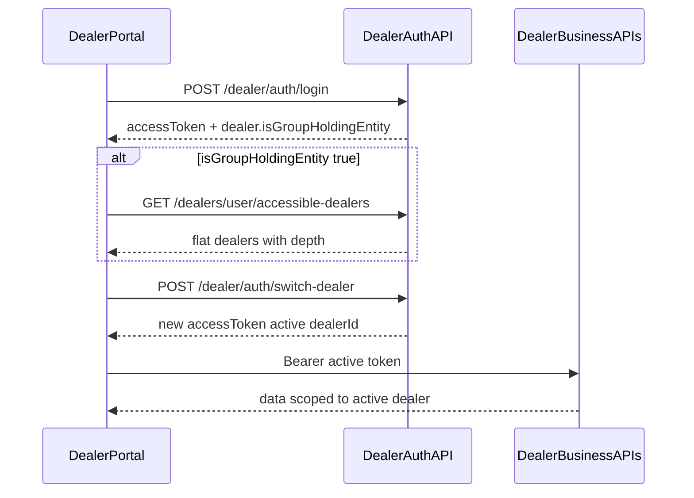

# Backend implementation prompt: Dealer group holding context switch

**Audience:** Node.js backend developer (FADA dealer auth / dealers APIs)  
**Requester:** Dealer portal (static Next.js export)  
**Document type:** Implementation prompt + API contract  
**Scope:** **Dealer only** — do **not** change admin auth, employee auth, or non-dealer portals

---

## 0. Mission (read first)

You are implementing **authorized dealer context switch** (impersonation within a group-holding tree) for the **dealer portal only**.

When a dealer logs in with `isGroupHoldingEntity: true`, the portal must:

1. Load all dealers that account is allowed to act as (today: direct children; later: nested descendants).
2. Let the user switch into a child / descendant dealer from the **navbar profile** (not Branch Management).
3. Run **all** dealer business APIs as that **active** dealer (new JWT / active `dealerId`).
4. Let the user return to the **original login (actor / main)** dealer without re-entering password.
5. Stay **future-ready** for nested sub-groups (child → grandchild → …) without redesigning auth.

This is **not** “filter branches by `groupDealerId` while keeping the parent token.” That pattern already exists on the portal for branches and will be **removed** once true context switch ships.

---

## 1. Hard scope (dealer only)

| In scope | Out of scope |
|----------|----------------|
| `POST /dealer/auth/login` (and OTP verify) dealer payload enrichment | Admin `/admin/*` auth |
| `GET /dealers/user/accessible-dealers` (new) | Employee mobile / employee auth |
| Existing `GET /dealers/user/group-dealers` (compat / deprecate) | Inventing child email/password login for switch |
| `POST /dealer/auth/switch-dealer` (new) | Requiring `groupDealerId` on every domain API after switch JWT exists |
| `POST /dealer/auth/exit-switch` **or** switch-back via same switch API | Portal UI implementation (frontend owns that after APIs land) |
| `GET /dealer/auth/me` context + breadcrumb | Changing static-export / Nginx deploy model |
| Logout / revoke behavior for switched sessions | |
| JWT claims for active vs actor dealer | |
| DB fields for parent/root tree (dealer records) | |

**All paths below are Node paths** (no `/api` prefix). The dealer portal prefixes `/api` only when proxy mode is on.

---

## 2. Mandatory process (do this before writing code)

**Do not implement until risks are reviewed and explicitly approved.**

1. **Inspect existing code and patterns first**
   - Current dealer login / OTP verify / logout / JWT issuance and validation middleware.
   - Current `GET /dealers/user/group-dealers` implementation and how parent↔child dealers are stored.
   - How `Authorization: Bearer` maps to “current dealer” on outlets, employees, invitations, profile, etc.
   - Existing success/error envelopes (`success`, `message`, `data`) — **match them**.
2. **Write a short risk list** (see §3) against *this* codebase (token shape, sessions table, revoke, audits).
3. **Propose** exact claim names, table columns, and route names if they must differ from this doc — call out breaking changes.
4. **Get explicit approval** from tech lead / product owner.
5. **Only then** implement, with tests for descendant auth, inactive targets, exit-switch, and logout.

---

## 3. Risks to surface before implementation

Call these out in your design review. Do not skip.

| Risk | Why it matters | Mitigation |
|------|----------------|------------|
| Impersonation abuse | Any dealer switching to unrelated dealers = data breach | Every switch: target must be a **descendant of `actorDealerId`** (original password/OTP login). Never trust client-only `dealerId`. |
| JWT claim change | Existing middleware may assume `id` = logged-in account only | Document claims; keep `id` = **active** dealer for all business APIs; add `actorDealerId` + `sessionKind`. Regression-test auth middleware. |
| Nested auth bugs | Switch A→B then B→C using B as actor breaks tree security | **Actor is immutable** for the session family: always the original login dealer. Refresh must preserve `actorDealerId`. |
| Breaking `group-dealers` consumers | Portal branches page already calls it | Keep endpoint working for direct children; add `accessible-dealers` for full tree; mark old as deprecated when ready. |
| Logout / revoke gaps | Switching issues new tokens; old tokens may remain valid | Revoke or short-TTL switched tokens; logout should invalidate active (+ ideally same actor session family). |
| Token TTL / refresh | Switched refresh could escalate privileges | Refresh must re-validate target still in actor subtree and still active. |
| Missing audit | Compliance / dispute | Log `actorId`, `fromDealerId`, `toDealerId`, IP, timestamp on every switch/exit. |
| Inactive / suspended child | Portal shows dealer but APIs fail oddly | Return `canSwitchTo: false` in list; switch returns **403** with clear message. |
| Circular parent links | Infinite loops in tree walk | DB constraint + cycle check on write; hard max depth (e.g. 5) as product policy. |
| Large trees | Login loader hangs | Paginate / search on accessible list; don’t return unbounded dumps without filters. |

**Approval gate:** Implementation starts only after stakeholders accept the risk mitigations above.

---

## 4. Current dealer portal reality (do not break blindly)

### 4.1 Auth today

- Portal calls `POST /dealer/auth/login` (and OTP verify) via client `apiFetch`.
- Response already includes top-level `accessToken` and `dealer` object (example shape used in production testing):

```json
{
  "success": true,
  "message": "Login successful",
  "accessToken": "<jwt>",
  "dealer": {
    "id": 16,
    "dealerCode": "98769875",
    "name": "devmail@gmail.com",
    "email": "devmail@gmail.com",
    "phone": "98765432145",
    "role": "dealer",
    "status": "pending",
    "isEmailVerified": true,
    "isActive": true,
    "mustChangePassword": false,
    "isGroupHoldingEntity": true,
    "createdAt": "2026-07-24T13:48:32.000Z",
    "updatedAt": "2026-08-12T05:12:04.158Z"
  }
}
```

- Portal stores token + profile in **`localStorage`** (not cookies / not SSR). Keys are client-side only and shared across tabs.
- Authenticated `401` → client clears session and redirects to login.

### 4.2 Group dealers today (filter only — temporary)

- Portal already calls:

```http
GET /dealers/user/group-dealers
Authorization: Bearer <dealer access token>
```

Example response in use:

```json
{
  "success": true,
  "message": "Group dealers fetched successfully",
  "data": [
    {
      "id": 26,
      "name": "Dev Sub Child",
      "dealerCode": "DLM-5655657"
    }
  ]
}
```

- Branch Management optionally filters outlets with query `groupDealerId` while **keeping the same parent token**. That is **not** full account access and will be removed on the frontend after context switch APIs are live.

### 4.3 What the portal will do after you ship switch APIs

- Move company switcher to **navbar profile**.
- On switch: **replace** active Bearer token with the switch response token.
- Stop relying on `groupDealerId` query for “act as child.”

---

## 5. Product goal



1. User logs in as main / holding dealer.
2. If `isGroupHoldingEntity === true`, portal shows a short loader and fetches accessible dealers **before** treating the session as fully ready for switching UI.
3. Default context = the logged-in dealer (main).
4. User selects a sub-dealer (and later nested sub-dealer) → switch API → new token.
5. Employees, outlets, profile, invitations, etc. all resolve from JWT **active** `id`.
6. User can switch back to main without password.
7. Nested depth (phase 2) uses the **same** APIs; only the tree grows.

---

## 6. Recommended domain model (future-ready nested tree)

Ensure each dealer record can represent a tree:

| Field | Type | Notes |
|-------|------|--------|
| `id` | PK | Dealer id |
| `parentDealerId` | FK nullable | `null` = top of its tree for that account |
| `rootDealerId` | FK / int | Top holding id; denormalize for fast “same tree?” checks |
| `isGroupHoldingEntity` | boolean | May have children |
| `isActive` / `status` | existing | Gate `canSwitchTo` |

Example:

```text
16  Main Group (holding)     parent=null  root=16
 └─ 26  Dev Sub Child        parent=16    root=16
     └─ 40  City Outlet Co   parent=26    root=16
 └─ 27  Another Child        parent=16    root=16
```

**Authorization rule (canonical):**

> Caller may switch to dealer `D` iff `D` is in the subtree of JWT `actorDealerId` (original login), and `D` is allowed (active, not deleted, policy OK).

Optional: materialized `path` (e.g. `/16/26/40`) for indexed descendant checks.

**MVP:** depth 0 (self) + depth 1 (direct children) is enough if nested rows do not exist yet — but **schema and APIs must already support depth > 1**.

---

## 7. JWT claims (required)

Every dealer access token issued after this work should carry:

| Claim | Meaning |
|-------|---------|
| `id` | **Active** dealer — all business APIs scope to this |
| `email` / `role` | As today (prefer active dealer’s identity) |
| `actorDealerId` | Dealer who originally authenticated with password/OTP |
| `rootDealerId` | Tree root for the actor (usually actor’s root) |
| `sessionKind` | `"direct"` \| `"switched"` |

Rules:

- Direct login: `id === actorDealerId`, `sessionKind: "direct"`.
- After switch: `id` = target, `actorDealerId` unchanged, `sessionKind: "switched"`.
- Business handlers continue to use **`id` only** for “whose data?”.
- Switch / accessible-list authorization uses **`actorDealerId`**, not active `id`.
- Refresh token rotation must preserve actor + active target and re-check membership.

---

## 8. APIs to build / extend

Match existing envelopes: `{ success, message, data? }` plus auth token fields where noted.

### 8.1 Enrich login and OTP verify (dealer object)

Endpoints:

- `POST /dealer/auth/login`
- `POST /dealer/auth/login-otp/verify` (same dealer fields)

Ensure `dealer` **always** includes (in addition to existing fields):

```json
{
  "id": 16,
  "dealerCode": "98769875",
  "name": "Main Group",
  "email": "devmail@gmail.com",
  "role": "dealer",
  "status": "pending",
  "isEmailVerified": true,
  "isActive": true,
  "mustChangePassword": false,
  "isGroupHoldingEntity": true,
  "parentDealerId": null,
  "rootDealerId": 16
}
```

Issued JWT for this response must be `sessionKind: "direct"` with `actorDealerId = id`.

---

### 8.2 `GET /dealers/user/accessible-dealers` (new — preferred)

```http
GET /dealers/user/accessible-dealers?format=flat
Authorization: Bearer <token>
```

Optional query:

| Param | Notes |
|-------|--------|
| `format` | `flat` (default) or `tree` |
| `search` | optional name/code filter |
| `includeInactive` | default `false` |

**Critical:** Resolve the list from JWT **`actorDealerId`** (original login), even if the current token is switched. Otherwise nested switching UI breaks when user is “inside” a child.

#### Flat success (recommended default)

```json
{
  "success": true,
  "message": "Accessible dealers fetched successfully",
  "data": {
    "root": {
      "id": 16,
      "name": "Main Group",
      "dealerCode": "98769875",
      "isGroupHoldingEntity": true
    },
    "dealers": [
      {
        "id": 16,
        "name": "Main Group",
        "dealerCode": "98769875",
        "parentDealerId": null,
        "rootDealerId": 16,
        "depth": 0,
        "isGroupHoldingEntity": true,
        "isActive": true,
        "canSwitchTo": true
      },
      {
        "id": 26,
        "name": "Dev Sub Child",
        "dealerCode": "DLM-5655657",
        "parentDealerId": 16,
        "rootDealerId": 16,
        "depth": 1,
        "isGroupHoldingEntity": true,
        "isActive": true,
        "canSwitchTo": true
      },
      {
        "id": 40,
        "name": "City Outlet Co",
        "dealerCode": "DLM-999",
        "parentDealerId": 26,
        "rootDealerId": 16,
        "depth": 2,
        "isGroupHoldingEntity": false,
        "isActive": true,
        "canSwitchTo": true
      }
    ]
  }
}
```

Include **self** (`depth: 0`) so the portal can show “Main” as a first-class option.

#### Tree success (`format=tree`) — optional but nice

```json
{
  "success": true,
  "message": "Accessible dealers fetched successfully",
  "data": {
    "root": {
      "id": 16,
      "name": "Main Group",
      "dealerCode": "98769875",
      "isGroupHoldingEntity": true,
      "canSwitchTo": true,
      "children": [
        {
          "id": 26,
          "name": "Dev Sub Child",
          "dealerCode": "DLM-5655657",
          "isGroupHoldingEntity": true,
          "canSwitchTo": true,
          "children": [
            {
              "id": 40,
              "name": "City Outlet Co",
              "dealerCode": "DLM-999",
              "isGroupHoldingEntity": false,
              "canSwitchTo": true,
              "children": []
            }
          ]
        }
      ]
    }
  }
}
```

#### Errors

| Status | When |
|--------|------|
| `401` | Missing/invalid token |
| `403` | Non-dealer / not allowed |

If `isGroupHoldingEntity` is false and there are no descendants, return `dealers: [self only]` or empty children — portal will hide the switcher when there is nothing to switch to beyond self.

---

### 8.3 `GET /dealers/user/group-dealers` (existing — keep for compatibility)

Keep returning **direct children only** (array under `data`) as today so current portal builds do not break.

When `accessible-dealers` is stable, mark this endpoint **deprecated** in Swagger (Dealer profile / user section). Prefer not to remove it in the same release as switch.

---

### 8.4 `POST /dealer/auth/switch-dealer` (new — core)

```http
POST /dealer/auth/switch-dealer
Authorization: Bearer <current_token>
Content-Type: application/json

{
  "dealerId": 40
}
```

#### Success (mirror login envelope so frontend can reuse the same session writer)

```json
{
  "success": true,
  "message": "Switched dealer context",
  "accessToken": "<jwt id=40 actorDealerId=16 sessionKind=switched>",
  "refreshToken": "<optional>",
  "dealer": {
    "id": 40,
    "name": "City Outlet Co",
    "email": "child@example.com",
    "dealerCode": "DLM-999",
    "role": "dealer",
    "status": "active",
    "isEmailVerified": true,
    "isActive": true,
    "mustChangePassword": false,
    "isGroupHoldingEntity": false,
    "parentDealerId": 26,
    "rootDealerId": 16
  },
  "context": {
    "sessionKind": "switched",
    "actorDealerId": 16,
    "actorName": "Main Group",
    "actorDealerCode": "98769875",
    "breadcrumb": [
      { "id": 16, "name": "Main Group" },
      { "id": 26, "name": "Dev Sub Child" },
      { "id": 40, "name": "City Outlet Co" }
    ]
  }
}
```

#### Switch back to main / actor

Allow the same endpoint with `"dealerId": <actorDealerId>` (or self). Response should be `sessionKind: "direct"` (or equivalent exit).

#### Errors

| Status | When |
|--------|------|
| `400` | Missing / invalid `dealerId` |
| `401` | Invalid token |
| `403` | Target not in actor subtree / not allowed |
| `404` | Dealer not found |
| `403` or `409` | Target inactive / suspended / deleted (pick one code and document it; be consistent) |

Rate-limit this endpoint.

**Audit** every successful and failed switch attempt.

---

### 8.5 `POST /dealer/auth/exit-switch` (optional if 8.4 covers switch-back)

```http
POST /dealer/auth/exit-switch
Authorization: Bearer <switched_token>
```

Returns a **direct** token for `actorDealerId` + dealer + `context.sessionKind: "direct"`.

If you implement switch-back only via `switch-dealer`, document that clearly in Swagger and skip a separate route — **one clear path is enough**.

---

### 8.6 `GET /dealer/auth/me` (recommended)

Used on portal boot / refresh to sync header and switcher.

```http
GET /dealer/auth/me
Authorization: Bearer <token>
```

```json
{
  "success": true,
  "data": {
    "dealer": {
      "id": 40,
      "name": "City Outlet Co",
      "email": "child@example.com",
      "dealerCode": "DLM-999",
      "role": "dealer",
      "isGroupHoldingEntity": false,
      "parentDealerId": 26,
      "rootDealerId": 16,
      "isActive": true,
      "mustChangePassword": false
    },
    "context": {
      "sessionKind": "switched",
      "actorDealerId": 16,
      "actorName": "Main Group",
      "actorDealerCode": "98769875",
      "breadcrumb": [
        { "id": 16, "name": "Main Group" },
        { "id": 26, "name": "Dev Sub Child" },
        { "id": 40, "name": "City Outlet Co" }
      ]
    },
    "capabilities": {
      "canSwitchDealers": true,
      "accessibleDealerCount": 3
    }
  }
}
```

`canSwitchDealers` should be true when the **actor** has more than one switchable dealer in subtree (including self + at least one other), not when the active child is a holding entity unless that child also logged in as actor.

---

### 8.7 Logout

```http
POST /dealer/auth/logout
Authorization: Bearer <accessToken>
```

- Revoke the **active** access (and refresh if used).
- Ideally revoke other tokens in the same login/switch family for that actor session.
- Do not leave switched tokens valid after “logout from child UI.”

---

## 9. Nested dealers — how main handles subgroups

| Scenario | Expected behavior |
|----------|-------------------|
| Main (16) logs in | JWT actor=16; accessible list = full subtree |
| Switch to depth-1 (26) | Active id=26; business data is 26’s |
| Switch to depth-2 (40) | Same API; authorize via descendant of actor 16 |
| While on 26, switch to sibling 27 | Allowed **only** because actor is still 16 and 27 ∈ subtree(16) |
| Dealer 26 logs in with **own** password | actor=26; accessible = subtree(26) only; **cannot** switch to 16 or 27 |
| Infinite nesting | Supported via parent/root; enforce max depth if product requires |

Do **not** implement “login as child by guessing password.” Context switch is the only supported path for group operators.

---

## 10. Edge-case checklist (backend must handle)

- [ ] Holding flag true but **zero** children → list is self-only; portal hides switcher.
- [ ] Holding flag false → no switch UI; accessible list may be self-only.
- [ ] Switch to self / actor → returns direct session (clean exit).
- [ ] Switch A→B→C without exit → actor remains original login on every hop.
- [ ] Non-descendant `dealerId` → **403**.
- [ ] Inactive / suspended target → listed with `canSwitchTo: false` or omitted; switch **403**.
- [ ] Dealer reparented mid-session → next switch re-validates; stale target **403**.
- [ ] Expired token mid-switch → **401**.
- [ ] `mustChangePassword` on target → include flag; portal may force password change after switch.
- [ ] Circular parents → prevented at write time.
- [ ] Large subtree → search/pagination; document limits.
- [ ] Concurrent switches → last issued token wins; old tokens revoked or short-lived.
- [ ] OTP login path emits same `isGroupHoldingEntity` / parent / root fields as password login.

---

## 11. What we need from the frontend (contract for portal team)

Backend should assume the dealer portal will implement the following **after** APIs are approved and available. This section is the FE contract so BE can design responses FE can consume without extra round-trips.

### 11.1 Session storage

- Keep using **`localStorage`** for tokens (shared across tabs; not cookies / not SSR).
- Persist on login:
  - Active `accessToken` (+ refresh if provided).
  - Active profile: at least `id`, `name`, `email`, `role`, `dealerCode`, `isGroupHoldingEntity`, `parentDealerId`, `rootDealerId`.
- When `isGroupHoldingEntity === true` and accessible dealers length > 1:
  - Cache accessible dealers list for the navbar.
  - Keep an **actor snapshot** (actor token and/or actor profile from login) so UI can label “Acting under {main}” and recover after failed child calls **without** inventing tokens client-side.
- Prefer restoring actor via **`switch-dealer` / `exit-switch`** (server-issued token), not by forever trusting a client-held parent token alone — if FE keeps parent token, document revoke behavior with BE.

### 11.2 Post-login flow

1. `POST /dealer/auth/login` (or OTP verify) succeeds.
2. If `dealer.isGroupHoldingEntity === true`:
   - Show skeleton/loader (not a blank screen).
   - Call `GET /dealers/user/accessible-dealers`.
3. Enter portal with **main** as default selected context.
4. If flag false or only self in list → no switcher.

### 11.3 Navbar (not Branch Management)

- Remove (or stop using) Branch Management group dropdown and URL `?groupDealerId=`.
- Profile menu shows:
  - Signed-in / active dealer name.
  - List of accessible dealers (indent by `depth` or tree).
  - Default selection = actor/main after login.
- On select child:
  1. `POST /dealer/auth/switch-dealer` with `{ dealerId }`.
  2. Replace active session with response token + `dealer`.
  3. Store `context` for breadcrumb / “Viewing as”.
  4. Invalidate/refetch all domain queries (dashboard, employees, branches, etc.).
- On switch failure: toast error; **do not** overwrite active token.
- On select main: switch-back / exit; refetch.

### 11.4 Errors / session expiry

- Active `401` → clear **entire** portal session (active + actor snapshot + cached list) and redirect to login.
- Do not soft-empty failed domain APIs; show section error + retry (existing portal pattern).

### 11.5 Logout

- Call logout with **active** Bearer.
- Clear all local session keys (active + actor + group cache).

### 11.6 Mock mode

- Portal may mock switch + accessible list until `NEXT_PUBLIC_USE_MOCKS=false`; real HTTP must match this contract when mocks are off.

### 11.7 What FE does **not** need from BE

- FE should **not** need `groupDealerId` on every list endpoint once switch JWT is active.
- FE should **not** fabricate JWTs for children.

---

## 12. MVP vs phase 2

### MVP (ship first)

1. Login/OTP dealer fields: `isGroupHoldingEntity`, `parentDealerId`, `rootDealerId`.
2. JWT: `id`, `actorDealerId`, `rootDealerId`, `sessionKind`.
3. `GET /dealers/user/accessible-dealers` (flat + `depth`; include self).
4. `POST /dealer/auth/switch-dealer` (+ switch-back to actor).
5. `GET /dealer/auth/me` with `context`.
6. Logout revoke behavior documented and implemented.
7. Keep `group-dealers` working.
8. Audit logs + tests for 403 non-descendant and inactive targets.

### Phase 2

- Multi-level nesting in data (`depth` > 1).
- Optional `format=tree`.
- Search/pagination for large holdings.
- Shorter TTL for switched tokens if required by security review.

---

## 13. Acceptance criteria

- [ ] Changes are **dealer-only**; admin/employee auth untouched.
- [ ] Existing patterns inspected; risks listed; **implementation only after approval**.
- [ ] Holding login returns `isGroupHoldingEntity` consistently (password + OTP).
- [ ] Accessible list is actor-scoped and includes self + descendants with `depth` / `canSwitchTo`.
- [ ] Switch issues new JWT; business APIs return **target** dealer’s data with no extra query param.
- [ ] Non-descendant switch is **403**.
- [ ] Switch back to main works without password.
- [ ] Nested depth works with same APIs when data exists.
- [ ] Swagger updated under **Dealer - Auth** / **Dealer - Profile (user)** as appropriate.
- [ ] Frontend contract in §11 can be implemented without follow-up ambiguity on response shapes.

---

## 14. Out of scope (explicit)

- Admin or employee context switch.
- Password-based “login as” child from the holding UI.
- Forcing every domain endpoint to accept `groupDealerId` after switch is live.
- Dealer portal UI code in the Node repo (portal is a separate static app).
- Removing `group-dealers` in the same PR as introducing switch without a deprecation note.

---

## 15. Suggested reply format before you code

Please reply to this prompt with:

1. Confirmation this work is **dealer-only**.
2. What you found in **existing** auth / `group-dealers` code (short).
3. Your **risk list** and proposed mitigations (especially JWT + revoke).
4. Any field/claim/route names you must rename to match current Node conventions.
5. Estimate (MVP).
6. Explicit ask: **“Ready to implement after your approval?”**

Only after written approval should implementation PRs start.
